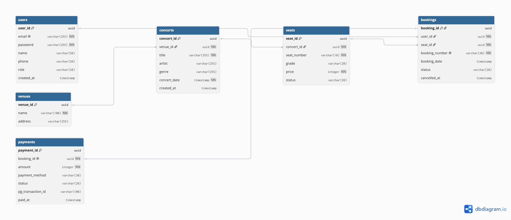

# 데이터베이스 설계서

## ERD


## 스키마 정의
```dbml
Table users {
  user_id uuid [primary key]
  email varchar(255) [unique, not null]
  password varchar(255) [not null]
  name varchar(50)
  phone varchar(20)
  role varchar(20) [default: 'user'] // admin, user ...
  created_at timestamp [default: `now()`]
} 

Table venues {
  venue_id uuid [primary key]
  name varchar(100) [not null]
  address varchar(255)
}

Table concerts {
  concert_id uuid [primary key]
  venue_id uuid [not null]
  title varchar(255) [not null]
  artist varchar(255)
  genre varchar(255)
  concert_date timestamp [not null]
  created_at timestamp [default: `now()`]
}

Table seats {
  seat_id uuid [primary key]
  concert_id uuid [not null]
  seat_number varchar(10) [not null]
  grade varchar(20) // unique, normal, gold ...
  price integer [not null]
  status varchar(20) // available, held, sold
  // version integer // 나중에 락 배우면 추가
}

Table bookings {
  booking_id uuid [primary key]
  user_id uuid [not null]
  seat_id uuid [not null]
  booking_number varchar(30) [unique, not null] // 예매 번호 노출 정보
  booking_date timestamp [default: `now()`]
  status varchar(20) [default: 'pending'] // pending(좌석 잡고 결제 X), confirmed, cancelled
  cancelled_at timestamp // 평소에는 null, status가 cancelled 일 때 값 들어감
}

Table payments {
  payment_id uuid [primary key]
  booking_id uuid [unique, not null]
  amount integer [not null] // 실제 결제 금액
  payment_method varchar(30) // kakaopay, toss, naverpay ...
  status varchar(20) [default: 'pending'] // pending(pg사 요청 대기), paid, failed, cancelled
  pg_transaction_id varchar(100) // pg사 거래 고유번호
  paid_at timestamp // 결제 시간
}


─────────────── 관계 정의 ───────────────

// 한 공연장에서 여러 콘서트 개최
Ref: concerts.venue_id > venues.venue_id [delete: restrict]

// 한 콘서트에 여러 좌석
Ref: seats.concert_id > concerts.concert_id [delete: cascade]

// 한 회원이 여러 건 예매
Ref: bookings.user_id > users.user_id [delete: restrict]

// 한 좌석에 여러 예매 이력(취소 후 재예매 포함)
Ref: bookings.seat_id > seats.seat_id [delete: restrict]

// 예매 1건당 결제 1건(payments.booking_id가 unique)
Ref: payments.booking_id - bookings.booking_id [delete: restrict]
```