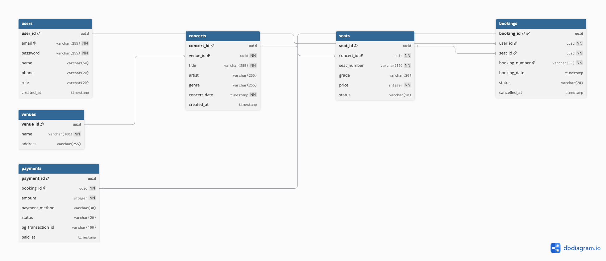

# 데이터베이스 설계서

## ERD


## 스키마 정의
```dbml
Table users {
  user_id uuid [primary key]
  email varchar(255) [unique, not null]
  password varchar(255) [not null]
  name varchar(50)
  phone varchar(20)
  role varchar(20) [default: 'USER'] // USER, ADMIN
  created_at timestamptz [default: `now()`]
} 

Table venues {
  venue_id uuid [primary key]
  name varchar(100) [not null]
  address varchar(255)
  created_at timestamptz [default: `now()`]
}

Table concerts {
  concert_id uuid [primary key]
  venue_id uuid [not null]
  title varchar(255) [not null]
  artist varchar(255)
  genre varchar(50)
  created_at timestamptz [default: `now()`]
}

Table concert_schedules {
  schedule_id uuid [primary key]
  concert_id uuid [not null]
  performance_at timestamptz [not null] // 공연 일시
  booking_open_at timestamptz [not null] // 예매 오픈 시각 (< performance_at)
  created_at timestamptz [default: `now()`]
  indexes {
    (concert_id, performance_at) [unique]
  }
}

Table seats {
  seat_id uuid [primary key]
  schedule_id uuid [not null]
  section varchar(10) [not null] // 구역 (A, B, ...)
  seat_row integer [not null] // 행
  seat_number integer [not null] // 번호
  grade varchar(20) [not null] // VIP, R, S, A
  price integer [not null] // 생성 시점 가격
  status varchar(20) [not null, default: 'AVAILABLE'] // AVAILABLE, HELD, SOLD
  // version bigint // 2단계(좌석 선점)에서 낙관적 락 적용 시 추가
  indexes {
    (schedule_id, section, seat_row, seat_number) [unique]
  }
}

Table bookings {
  booking_id uuid [primary key]
  user_id uuid [not null]
  seat_id uuid [not null]
  booking_number varchar(30) [unique, not null] // 예매 번호 노출 정보
  booking_date timestamptz [default: `now()`]
  status varchar(20) [default: 'pending'] // pending(좌석 잡고 결제 X), confirmed, cancelled
  cancelled_at timestamptz // 평소에는 null, status가 cancelled 일 때 값 들어감
}

Table payments {
  payment_id uuid [primary key]
  booking_id uuid [unique, not null]
  amount integer [not null] // 실제 결제 금액
  payment_method varchar(30) // kakaopay, toss, naverpay ...
  status varchar(20) [default: 'pending'] // pending(pg사 요청 대기), paid, failed, cancelled
  pg_transaction_id varchar(100) // pg사 거래 고유번호
  paid_at timestamptz // 결제 시간
}


// ─────────────── 관계 정의 ─────────────── //

// 한 공연장에서 여러 콘서트 개최
Ref: concerts.venue_id > venues.venue_id [delete: restrict]

// 한 공연에 여러 회차
Ref: concert_schedules.concert_id > concerts.concert_id [delete: restrict]

// 한 회차에 여러 좌석(좌석 상태는 회차마다 따로 관리)
Ref: seats.schedule_id > concert_schedules.schedule_id [delete: restrict]

// 한 회원이 여러 건 예매
Ref: bookings.user_id > users.user_id [delete: restrict]

// 한 좌석에 여러 예매 이력(취소 후 재예매 포함)
Ref: bookings.seat_id > seats.seat_id [delete: restrict]

// 예매 1건당 결제 1건(payments.booking_id가 unique)
Ref: payments.booking_id - bookings.booking_id [delete: restrict]
```